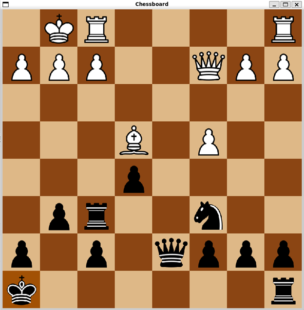

# Chess Engine

This is a playable game of chess implemented using C++ and SFML. It allows you to play chess with basic functionalities, including castling and en passant.

Development of a chess engine has started and will be available soon.

## Dependencies

- [SFML](https://www.sfml-dev.org/download.php) (Simple and Fast Multimedia Library)
- Ubuntu 24.04 (or any other Linux distribution)


## Installation

### Download Dependencies

1. Download and install SFML from the [official website](https://www.sfml-dev.org/download.php).
2. Make sure to set up SFML correctly in your development environment. You can follow the [official tutorial](https://www.sfml-dev.org/tutorials/2.5/start-vc.php) for guidance.

### Compile

1. Clone the repository:
    ```sh
    git clone https://github.com/eparly/chess_engine.git
    cd src
    ```

2. Compile the project:
    ```sh
    cg++ main.cpp board.cpp Piece.cpp -o chessboard -lsfml-graphics -lsfml-window -lsfml-system
    ```

## How to Play

1. Run the compiled executable:
    ```sh
    ./chessboard
    ```

2. A window will open displaying the chessboard.

3. Use the mouse to select and move pieces:
    - Left-click on a piece to select it.
    - Left-click on a valid destination square to move the selected piece.

4. The game will alternate turns between white and black pieces.



## Key Classes and Functions

- `Board` class in [src/board.h](src/board.h) and [src/board.cpp](src/board.cpp)
    - `generateLegalMoves()`: Generates all legal moves for the current player.
    - `initializeBoard()`: Initializes the board with pieces using a FEN string.
    - `draw(sf::RenderWindow& window)`: Draws the board and pieces on the window.
    - `endTurn()`: Ends the current turn and updates legal moves.

- `Piece` class in [src/piece.h](src/piece.h) and [src/Piece.cpp](src/Piece.cpp)
    - `draw(sf::RenderWindow& window)`: Draws the piece on the window.
    - `getBoardPosition() const`: Returns the position of the piece on the board.